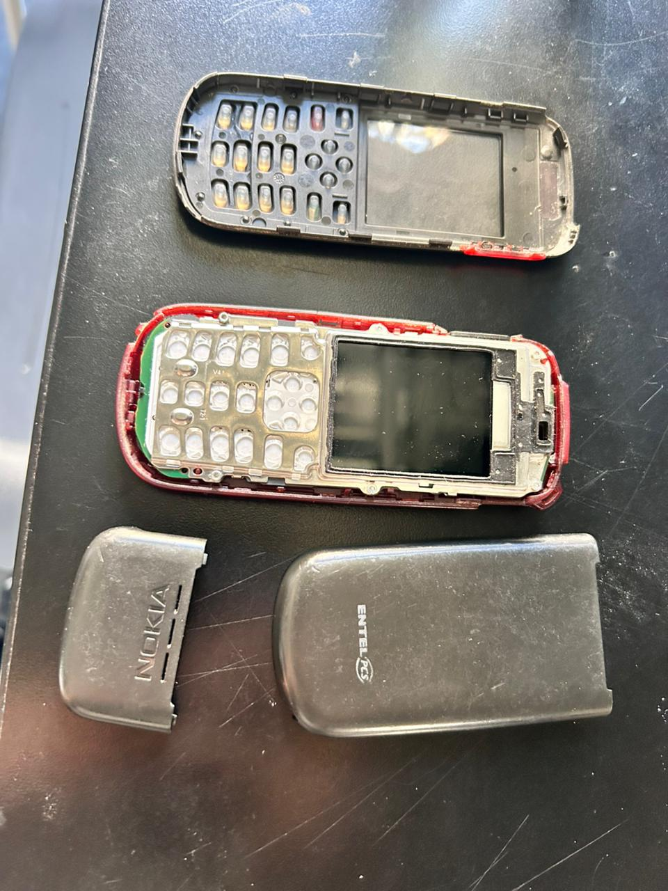
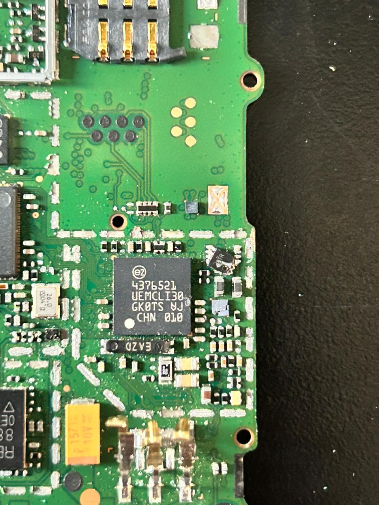
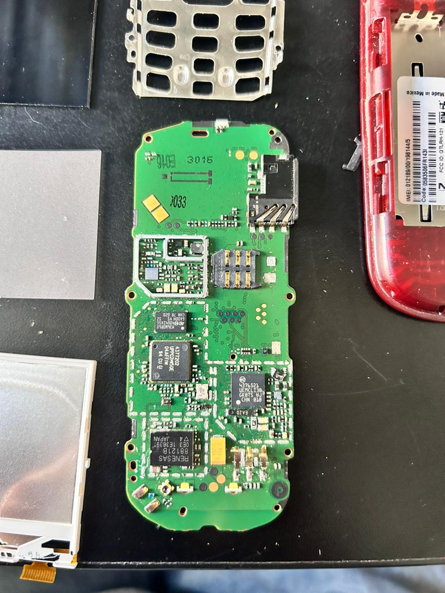
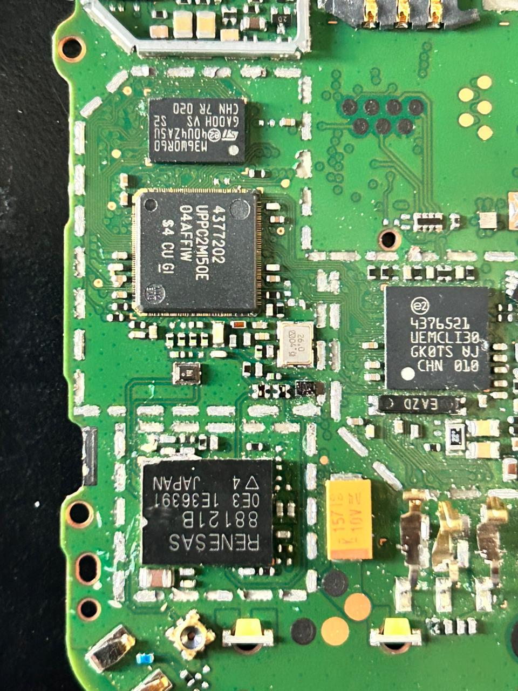
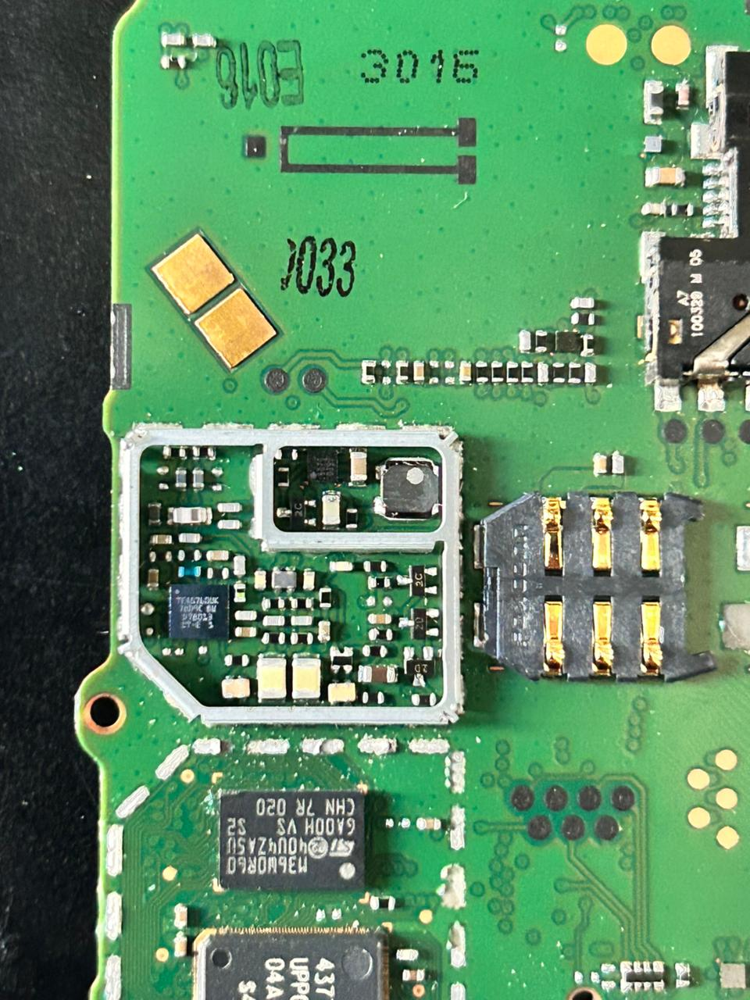
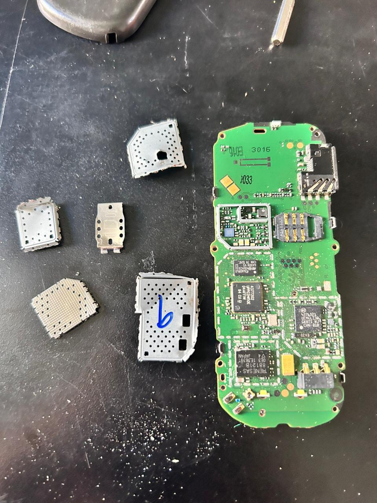

# sesion-04a

## **Encargo**

# **Nokia 1661**

La Carcasa (El Cuerpo): Es la parte roja y gris. La roja es el chasis que sostiene todo, y la gris es la que tocas con tus manos.

La PCB (La Placa Verde): Es el "suelo" donde viven todos los componentes. Esos caminos brillantes que ves son como carreteras de cobre por donde viaja la electricidad

La Pantalla (LCD): Ese cuadrado negro con un borde metálico y un cablecito naranja. Es la ventana que nos dice qué está pasando dentro.

El Teclado: Esa lámina blanca con burbujitas. Cuando aprietas una, la burbuja baja y toca la placa verde, avisándole al teléfono: ¨alguien pulsó el 5¨

El Procesador(Cerebro): Es el más grande (marcado como 4377202).Decide qué mostrar en pantalla y qué hacer cuando tocas un botón.

El Chip de Radio(La Oreja): El que está cerca de la antena (marcado como RENESAS). Es el encargado de escuchar las ondas que vienen del aire y convertirlas en sonidos o mensajes.

Condensadores (C): Son los bloquesitos color café claro o arena, su trabajo es guardar un poquito de electricidad para soltarla rápido si el chip la necesita,son como "mini baterías" de emergencia.

Resistencias (R): Son los puntos negros más planos. Sirven para frenar la electricidad. Si viene mucha corriente, la resistencia dice: "Alto,Solo pasarán 5 voltios", para que nada se queme.

Pines Dorados: Si ves la placa, tiene unos "dientitos" dorados que sobresalen. Esos chocan contra la batería para absorber su energía.

Antena por contacto: En la carcasa roja hay una parte metálica. La placa tiene unos resortes diminutos que, al cerrar el teléfono, empujan ese metal para poder "gritar" la señal hacia afuera.

El cable flexible: La pantalla se conecta con esa tirita naranja que se enchufa en un conector especial en la placa. Es la única parte que parece un "cable" real.

## **encargo 2**

En este mundo medio mágico, la electricidad es como un río de estrellas que viaja por el dispositivo. Los condensadores guardan energía, los chips la transforman en palabras e imágenes, y todo funciona gracias a pequeños “guardianes” que mantienen el orden.

Cuando tocamos el teclado, se activa una red invisible que sigue el ritmo de un cristal, como un corazón de frecuencias. Al final, todo esto hace que el aparato se sienta como un traductor de emociones, donde la luz de la pantalla es como un pequeño sol que nos conecta con los demás
