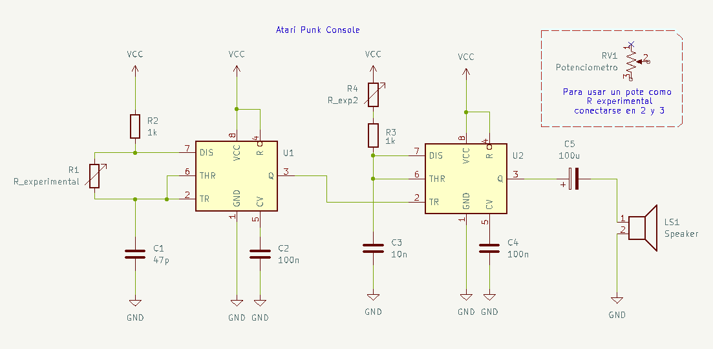
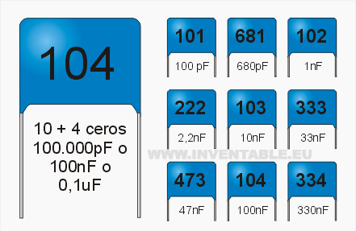

# sesion-03b

### Circuito astable:

No tiene un estado estable, por lo que oscila continuamente entre dos estados, generando una señal de salida periódica en forma de onda cuadrada. Esta oscilación se produce debido a la carga y descarga de condensadores en el circuito, lo que provoca que los dispositivos activos cambien de estado y generen pulsos de manera continua.

A-” significa “sin”, entonces es sin estado estable. Por eso el circuito nunca se queda quieto y cambia constantemente entre alto y bajo.

### Circuito monoestable:

Tiene un estado estable y puede ser disparado a un estado diferente de forma temporal al recibir un impulso externo. Este cambio de estado dura un tiempo determinado, definido por una constante de tiempo que depende de 

Mono-” significa “uno”, o sea tiene un solo estado estable. Solo cambia cuando recibe un impulso, pero después vuelve a ese único estado estable.

### Ejemplo hecho en clases

https://github.com/user-attachments/assets/1f744446-ae42-4bc2-af81-66c8bdd15f16

### Ejercicio Atari Punk

(R1 va a ser un pote, R4 va a ser un LDR, C1 va ser de 100n)

https://github.com/user-attachments/assets/38540c19-a8ce-47c5-8d8f-a1c418963dd9

https://github.com/user-attachments/assets/0a20732c-d86a-47b5-a137-a2176fe2f87b

Nos funcionó bien por mucho rato, pero después uno de los chips se quemó y el sonido empezó a escucharse muy despacito.

También probamos cambiando los capacitores y notamos que mientras menor es el valor en µF, más agudo es el sonido.

---
### Datos donde comprar materiales:

Electronica Ibarra es la más barata si pagan en efectivo

Electronica Hobby es la más grande, pero a veces tiene filas largas

Electronica ORFALI tiene la señora más amable, pero a veces es un poco cara

Electronica MINY tiene componentes más extraños

Dentro de Galería SUR se encuentran desarmadurías donde encuentran componentes más exóticos aún

---

### Equivalencia de Capacitores Cerámicos

(Calculadora) https://www.learningaboutelectronics.com/Articulos/Calculadora-codigo-de-condensadores.php#respuesta

