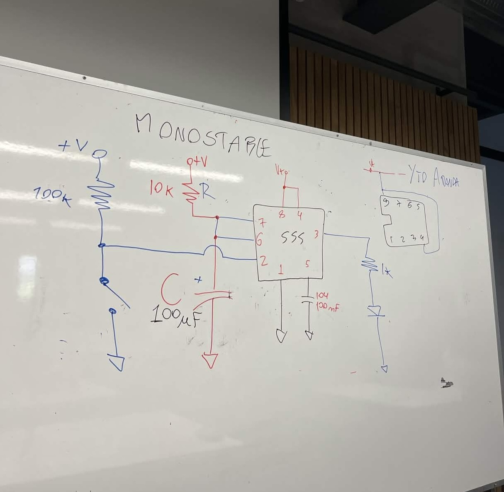

# sesion-03b

# Apuntes 27/03

### Resistencia Equivalente (Req)

Se nos explicó que la resistencia equivalente (Req) en serie se calcula al sumarlas entre ellas, es decir: `Req = R1 + R2`, mientras que la resistencia quivalente de un circuito paralelo se calcula de la siguiente manera: `1/Req = 1/R1 + 1/R2`, que es lo mismo que decir `Req = R1 * R2 / R1 + R2`. En el caso especial de que las resistencias tengan el mismo valor, se calcula de ésta forma: `Req = R1 * R2 / 2R1`, que es lo mismo que decir `R1 / 2`.

### Circuito monostable

Nos enseñaron cómo era un circuito monostable (mono-estable) ya que la clase pasada vimos cómo funcionaba el circuito astable (a-estable). Se nos indicó seguir el esquemático que dibujaron en la pizarra, el cual era el siguiente:

 (la foto la compartió emi por el server del taller, no me pertenece)

Al seguir el esquemático en la protoboard, quedó un circuito que al apretar el botón el LED se prende y se apaga por si solo. Si lo mantenías presionado, se mantenía encendido hata que lo soltabas (en mi video no se puede apreciar mucho el LED debido a que me gusta usar muchos cables para no perderme, y eso hace que se pierda un poco la luz del LED, pido disculpas).

### Atari Punk Console

Se nos enseñó lo que es el Atari Punk Console, el cual está hecho con dos chips 555, uno tenindo un circuito stable y el otro monostable, por lo que nos dieron el esquemático y lo hicimos en nuestras protoboards.

En mi caso, tenía una protoboard chiquita asi que con mi compañero nos encargamos de hacer un circuito en cada protoboard personal y luego las unimos. Al unirlo funcionó a la primera lo cual fue maravilloso, por lo que nos emocionamos y empezamos a hacer un poco de ruido y nos dijeron que fueramos a hacer ruido afuera.

Cuando volvimos a la sala y estabamos justo en frente de la puerta el atari punk empezó a hacer una melodía por si solo, lo que nos emocionó mucho y no alcanzamos a grabar cuando nos movimos para intentarlo. Cuando dejó de sonar, intentamos replicar el sonido moviendo cables para los lados y empujando un poco el potenciómetro, pero nada fue igual a lo que habíamos oido lo cual nos dejó un poco decepcionados. Luego de tratar de replicar lo que había sucedido, llegamos a la conclusión de que solo se había movido un cable y quedó mal conectado lo cual provocó que hiciera una melodía por si solo.

(Ver videos en carpeta de imagenes "intento-recuperar-melodia1", "intento-recuperar-melodia2" para ver cómo se movieron los componentes de la protoboard).
